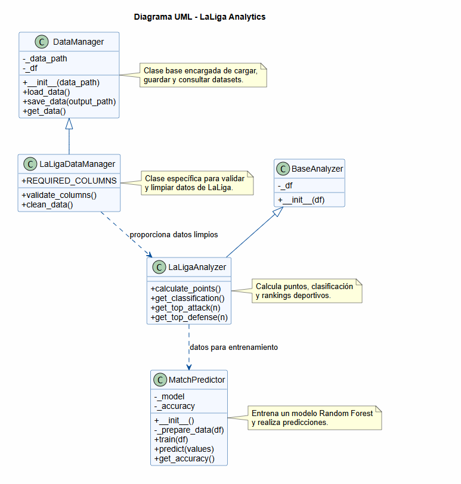

# LaLiga Analytics

LaLiga Analytics es una aplicación web desarrollada en Python para analizar datos históricos de LaLiga desde la temporada 2020-2021 hasta la actualidad.

El proyecto transforma varios archivos CSV con estadísticas de partidos en una herramienta visual e interactiva. Desde el dashboard se pueden consultar clasificaciones por temporada, gráficos de rendimiento, comparaciones entre equipos y una predicción básica mediante Inteligencia Artificial.

El trabajo combina tres partes principales:

- gestión y limpieza de datos;
- análisis y visualización de información deportiva;
- programación orientada a objetos, testing y modelo predictivo.

## 1. Análisis del problema

El problema que se intenta resolver es que los datos deportivos en formato CSV no son cómodos de consultar directamente. Aunque contienen información útil, como goles, tiros, tiros a puerta o tarjetas, trabajar con varios archivos separados por temporada dificulta comparar equipos y obtener conclusiones rápidas.

Por ese motivo, el objetivo del proyecto ha sido crear una aplicación capaz de:

- cargar datos de varias temporadas;
- limpiar y unificar los CSV originales;
- calcular métricas deportivas;
- mostrar tablas y gráficos de forma visual;
- comparar equipos;
- realizar una predicción básica con Machine Learning.

La aplicación está dirigida a usuarios interesados en el análisis deportivo, estudiantes de datos, aficionados al fútbol o personas que quieran consultar información de LaLiga de forma sencilla.

## 2. Objetivo del proyecto

El objetivo principal es desarrollar un sistema de gestión y análisis de datos deportivos aplicando Python, Pandas, Streamlit, programación orientada a objetos y pruebas automáticas.

A partir del dataset limpio, la aplicación calcula métricas como:

- puntos;
- goles a favor;
- goles en contra;
- diferencia de goles;
- rankings ofensivos;
- rankings defensivos;
- comparación entre equipos.

Además, el proyecto incorpora un modelo Random Forest Classifier, que predice si un partido termina con victoria local, empate o victoria visitante a partir de estadísticas introducidas por el usuario.

## 3. Tecnologías utilizadas

- Python
- Pandas
- NumPy
- Matplotlib
- Streamlit
- Scikit-learn
- Pytest
- GitHub

## 4. Estructura del proyecto

```text
laliga-analytics-TFG/
│
├── app/
│   └── dashboard.py
│
├── data/
│   ├── 2020-2021.csv
│   ├── 2021-2022.csv
│   ├── 2022-2023.csv
│   ├── 2023-2024.csv
│   ├── 2024-2025.csv
│   ├── 2025-2026.csv
│   └── laliga_clean.csv
│
├── docs/
│   ├── uml_diagram.png
│   └── conclusiones_analisis.md
│
├── outputs/
│   └── graficos/
│
├── src/
│   ├── analisis.py
│   ├── analytics.py
│   ├── graficos.py
│   ├── main.py
│   ├── merge_data.py
│   ├── modelo.py
│   └── models.py
│
├── tests/
│   ├── __init__.py
│   ├── test_analytics.py
│   ├── test_data.py
│   └── test_modelo.py
│
├── .gitignore
├── pytest.ini
├── requirements.txt
└── README.md
```
## Diagrama UML

El proyecto incluye una estructura orientada a objetos para organizar la carga de datos, el análisis deportivo y el modelo predictivo.



## 5. Arquitectura de clases

El proyecto incorpora programación orientada a objetos en el archivo:

```text
src/models.py
```

Las clases principales son:

- `DataManager`
- `LaLigaDataManager`
- `BaseAnalyzer`
- `LaLigaAnalyzer`
- `MatchPredictor`

### Explicación de la jerarquía

La clase `DataManager` funciona como clase base para gestionar la carga y guardado de datos. A partir de ella se crea `LaLigaDataManager`, una clase hija especializada en validar y limpiar datasets de LaLiga.

También se utiliza una clase base llamada `BaseAnalyzer`, que almacena el DataFrame de trabajo. De ella hereda `LaLigaAnalyzer`, que contiene métodos para calcular puntos, clasificaciones y rankings.

Por último, la clase `MatchPredictor` encapsula el modelo de Inteligencia Artificial. Esta clase se encarga de preparar los datos, entrenar el modelo Random Forest, calcular la precisión y realizar predicciones.

### Encapsulamiento

El proyecto utiliza atributos privados para proteger la información interna de las clases:

- `_data_path`
- `_df`
- `_model`
- `_accuracy`

Esto permite organizar mejor el código y separar responsabilidades entre carga de datos, análisis y predicción.

## 6. Diagrama UML

El siguiente diagrama muestra la estructura orientada a objetos del proyecto, incluyendo herencia y clases principales.


## 7. Gestión de datos

Los datos originales proceden de Football-Data y corresponden a diferentes temporadas de LaLiga.

Cada temporada se encuentra en un archivo CSV independiente. Para trabajar con todos los datos de forma conjunta, se creó un proceso de limpieza y unión de datasets mediante el archivo:

```text
src/merge_data.py
```

A partir de los CSV originales se genera el archivo limpio:

```text
data/laliga_clean.csv
```

Este archivo es la base principal del proyecto y se utiliza tanto en el dashboard como en el modelo de Inteligencia Artificial.

### Columnas utilizadas

El dataset limpio contiene columnas como:

- `fecha`
- `local`
- `visitante`
- `goles_local`
- `goles_visitante`
- `tiros_local`
- `tiros_visitante`
- `tiros_puerta_local`
- `tiros_puerta_visitante`
- `amarillas_local`
- `amarillas_visitante`
- `temporada`

### Limpieza realizada

Durante la preparación de datos se realizaron las siguientes tareas:

- selección de columnas relevantes;
- eliminación de columnas no necesarias;
- renombrado de columnas para mejorar la legibilidad;
- unión de varias temporadas en un único dataset;
- control de columnas obligatorias;
- conversión de fechas;
- conversión de valores numéricos;
- tratamiento de valores nulos.

## 8. Análisis de datos

El análisis se centra en obtener información deportiva útil a partir del dataset limpio.

Las métricas principales calculadas son:

- puntos por equipo;
- goles a favor;
- goles en contra;
- diferencia de goles;
- total de partidos;
- total de goles;
- rankings ofensivos;
- rankings defensivos.

Para calcular la clasificación se tienen en cuenta los partidos jugados como local y como visitante. Esto es necesario porque en el dataset los equipos aparecen en columnas diferentes según jueguen en casa o fuera.

El sistema de puntuación aplicado es:

- victoria: 3 puntos;
- empate: 1 punto;
- derrota: 0 puntos.

## 9. Visualización de datos

La visualización se realiza mediante Streamlit y Matplotlib.

El dashboard permite:

- seleccionar una temporada;
- consultar la clasificación;
- visualizar gráficos de puntos;
- visualizar gráficos de goles a favor;
- visualizar gráficos defensivos;
- comparar un equipo individual;
- comparar dos equipos;
- probar una predicción con IA.

Los gráficos ayudan a interpretar los resultados de forma más rápida que una tabla tradicional.

## 10. Modelo de Inteligencia Artificial

El proyecto utiliza un modelo Random Forest Classifier de Scikit-learn.

El modelo usa como variables de entrada:

- tiros del equipo local;
- tiros del equipo visitante;
- tiros a puerta del equipo local;
- tiros a puerta del equipo visitante;
- tarjetas amarillas del equipo local;
- tarjetas amarillas del equipo visitante.

La salida del modelo puede ser:

- victoria local;
- empate;
- victoria visitante.

En las pruebas realizadas, el modelo obtuvo una precisión aproximada del 50,9%.

Este resultado debe interpretarse como una primera aproximación práctica al uso de Machine Learning en fútbol. No se trata de una predicción profesional, ya que el fútbol depende de muchos factores que no aparecen en el dataset, como lesiones, alineaciones, estado de forma o contexto del partido.

## 11. Robustez y control de errores

El proyecto incorpora control de errores en partes importantes del sistema, especialmente en la carga de datos y en el dashboard.

Se contemplan errores como:

- archivo CSV no encontrado;
- archivo vacío;
- columnas obligatorias ausentes;
- errores al entrenar el modelo;
- errores al cargar datos en Streamlit.

En caso de error, el dashboard muestra un mensaje mediante `st.error()` y detiene la ejecución con `st.stop()` para evitar fallos poco claros para el usuario.

## 12. Testing

El proyecto incluye pruebas automáticas con Pytest en la carpeta:

```text
tests/
```

Las pruebas comprueban:

- que existe el dataset limpio;
- que el dataset contiene las columnas principales;
- que el cálculo de puntos funciona correctamente;
- que la clasificación genera las columnas esperadas;
- que el modelo de IA entrena y devuelve una predicción válida.

Para ejecutar las pruebas:

```bash
pytest
```

## 13. Instalación

Primero se recomienda crear un entorno virtual:

```bash
python -m venv venv
```

Activar el entorno virtual en Windows:

```bash
venv\Scripts\activate
```

Instalar las dependencias necesarias:

```bash
pip install -r requirements.txt
```

## 14. Ejecutar el dashboard

Para lanzar la aplicación web con Streamlit:

```bash
streamlit run app/dashboard.py
```

Al ejecutar este comando, se abrirá una dirección local en el navegador desde la que se puede utilizar el dashboard de LaLiga Analytics.

## 15. Ejecutar análisis por consola

También se puede ejecutar un análisis básico desde consola:

```bash
python src/main.py
```

Este comando carga el dataset limpio, calcula la clasificación general y muestra el Top 10 de equipos por puntos.

## 16. Ejecutar pruebas

Para ejecutar las pruebas automáticas:

```bash
pytest
```

## 17. Conclusiones del análisis

Las conclusiones principales del análisis se encuentran en:

```text
docs/conclusiones_analisis.md
```

De forma resumida, el análisis permite observar qué equipos han tenido mayor regularidad en puntos, cuáles han destacado más en ataque y cuáles han sido más sólidos defensivamente.

También se observa que el modelo de IA puede detectar ciertos patrones, aunque su precisión está limitada por las variables disponibles.

## 18. Posibles mejoras futuras

Algunas mejoras futuras serían:

- añadir más temporadas históricas;
- incorporar otras competiciones;
- incluir datos de jugadores;
- añadir variables previas al partido;
- mejorar el modelo predictivo;
- desplegar el dashboard en la nube.

## 19. Repositorio

El código fuente del proyecto está disponible en GitHub:

```text
https://github.com/jorgeesg26/laliga-analytics-TFG.git
```

## 20. Autor

Jorge Salguero Abad
